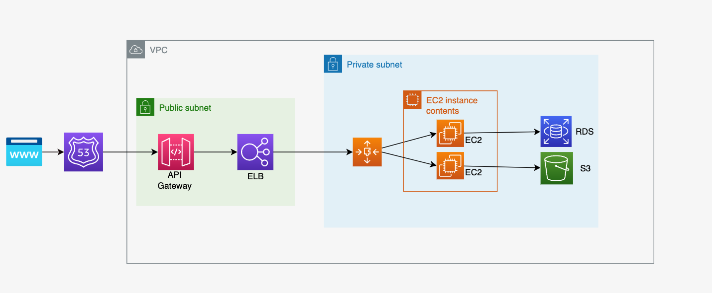

# TASK
## Part 1: Designing Cloud Infrastructure
### Task:
* Design a cloud infrastructure for a scalable web application.
* Include components like compute instances, storage, and network configurations.
* Use AWS EC2, S3, and VPC to build the basic architecture.

## Part 2: IAM Configuration
### Task:
* Define IAM roles and policies for different components of the architecture, such as developers, admins, and application servers.
* Ensure that each role adheres to the principle of least privilege.

**Roles**
* Develop: 
    * Permisos de lectura y escitura para S3
    * Acceso limitado a instancias EC2 para pruebas y desarrollo
    * acceso a CloudWatch Log para monitoreo
* Admin: 
    * Acceso a todos los recursos de AWS
    * Administracion de politicas de IAM
* AppServer: 
    * Permisos necesarios para interactuar con S3 y otros servicios necesario para la aplicacion
    * Acceso a recursos especificos

## Part 3: Resource Management Strategy
### Task:
Develop a strategy for managing resources that includes auto-scaling, load balancing, and cost optimization using AWS Auto Scaling, ELB, and AWS Budgets.

**Escalado Automático (AWS Auto Scaling):**
* Crear un grupo de autoescalado para las instancias EC2.
* Definir políticas de escalado basadas en métricas como el uso de CPU o la latencia de las solicitudes.
* Utilizar un Application Load Balancer (ALB) para distribuir el tráfico entrante entre las instancias EC2.
* Configurar reglas de enrutamiento para manejar diferentes tipos de tráfico.

**Optimización de Costos (AWS Budgets)**
* Establecer presupuestos mensuales para los diferentes componentes de la infraestructura.
* Configurar alertas para cuando el gasto se acerque al presupuesto establecido.

**Revisar Opciones de Precios:**
* Considerar instancias reservadas o instancias spot para reducir costos en instancias EC2.

## Part 4: Theoretical Implementation
Using the AWS services identified, outline the architecture for the web application. Describe how each component interacts with others, focusing on the flow of data and control between services. This description should detail the role of each service in the architecture, ensuring a clear understanding of their interactions and dependencies.

### Result
La arquitectura de la aplicación web en AWS utiliza varios servicios principales para garantizar la escalabilidad, disponibilidad y seguridad de la aplicación. Los componentes principales incluyen EC2 para las instancias de servidor de aplicaciones, S3 para el almacenamiento de objetos estáticos, RDS para la base de datos relacional y VPC para la configuración de la red.

**Interacciones entre Componentes:**
1. **Elastic Load Balancer (ELB)**:
   - Recibe el tráfico entrante de los usuarios y lo distribuye entre las instancias EC2 en el grupo de autoescalado.
   - Proporciona una interfaz de red pública para que los usuarios accedan a la aplicación.
2. **Auto Scaling Group**:
   - Controla el número de instancias EC2 en función de la carga de trabajo.
   - Escala automáticamente el número de instancias hacia arriba o hacia abajo para satisfacer la demanda de tráfico.
3. **EC2 Instances**:
   - Ejecutan la aplicación web y sirven solicitudes de los usuarios.
   - Se configuran en grupos de autoescalado para garantizar que siempre haya suficientes instancias disponibles para manejar la carga de trabajo.
4. **RDS (Base de Datos Relacional)**:
   - Almacena datos estructurados de la aplicación web, como usuarios, publicaciones y configuraciones.
   - Utiliza RDS para la gestión de la base de datos, incluida la copia de seguridad, la replicación y la escalabilidad.
5. **S3 (Almacenamiento de Objetos)**:
   - Almacena objetos estáticos como imágenes, videos y archivos CSS/JS de la aplicación web.
   - Proporciona un almacenamiento duradero y escalable para los recursos estáticos de la aplicación

## Part 5: Discussion and Evaluation
**Discussion Points:**
* Explain the choice of services and how they interact to provide a resilient and secure infrastructure.
* Discuss how the designed IAM policies contribute to overall security.
* Review the resource management strategy to ensure it meets the scalability and cost-efficiency needs.

### Result
- Se eligieron servicios como EC2, ELB, RDS y S3 debido a su capacidad para proporcionar una infraestructura altamente disponible y escalable.
- La VPC se utiliza para aislar y proteger la infraestructura, garantizando la seguridad de la red y la privacidad de los datos.
- Las políticas de IAM están diseñadas para seguir el principio de privilegio mínimo, garantizando que cada rol tenga acceso solo a los recursos necesarios para su función.

