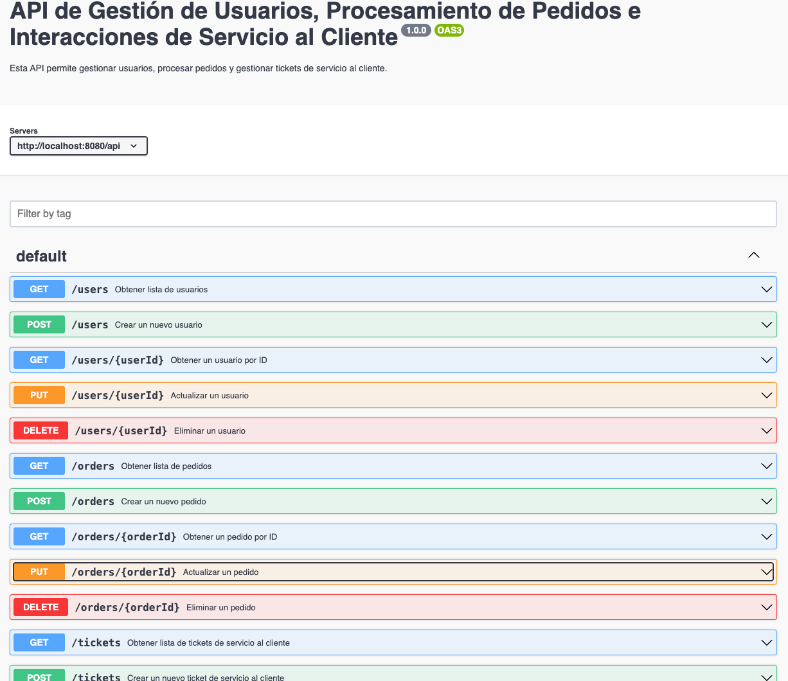

# API Design Session:
## Endpoint Design:
Participants will define RESTful API endpoints for user management, order processing, and customer service interactions.

## Resource Modeling:
Define the data structures and resource models required to support the API functionality, such as user profiles, order details, and customer tickets.

## Documentation:
Document each API endpoint, specifying required parameters, possible responses, and error codes to ensure clarity and completeness. Emphasis will be placed on adherence to best practices in API documentation to enhance ease of use and maintainability.

# Resultado
