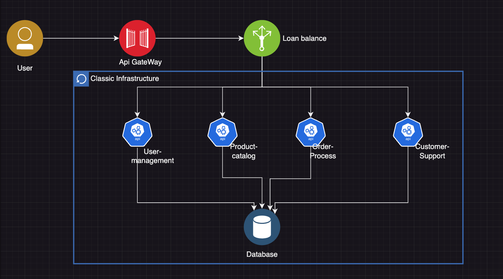

# Tasks:
## Design Exercise:
* **Application Brief:** Participants are given a description of a monolithic e-commerce application handling user management, product catalog, order processing, and customer support.
* **Task**: Identify and outline potential microservices based on domain-driven design principles. Participants will determine service boundaries, define how services will communicate, and plan how to handle shared data.

## Monolithic E-Commerce Application Description:
The application is a traditional e-commerce platform that encompasses all functionalities within a single, unified software architecture. The application handles the following key operations:
* **User Management:** Manages user profiles, authentication, and authorization. It stores personal information, manages login sessions, and handles user preferences.
* **Product Catalog:** Maintains a comprehensive list of products, including descriptions, pricing, images, and inventory levels. It supports product search and categorization functionalities.
Order Processing: Manages all aspects of the ordering process, from cart management to order placement, payment processing, and order history tracking.
* **Customer Support:** Handles customer inquiries, returns, complaints, and feedback through a ticket-based system integrated with the user and order databases.

The application is built on a single relational database that holds all user data, product information, orders, and customer support interactions. It currently operates on a single code base with a web-based frontend that communicates directly with the backend server.

The platform has been experiencing challenges with scaling during high-traffic periods, frequent downtimes during updates, and increasing difficulty in implementing new features without affecting existing functionalities. The goal is to decompose this monolithic architecture into a microservices-based architecture to address these issues and improve overall agility and scalability.

# Resultado

Se realizan evaluaciones del monolito para analizar la arquitectura existente e identificar componentes y dependencias clave. Para si dividir las funcionalidades del monolito en diferentes compomponentes, cada uno de los cuales maneja una funcion especifica para el negocio, esto permite mayor escalabilidad y flexibilidad al implementar y mantener el sistema.

Para la implementacion de la migracion, esta es conveniente hacerla de manera gradual, migrando un solo servicio a la vez comenzando con un componente de menor riesgo, es este caso seria:
* user-management
* Order-process
* Product-catalog
* Customer-Support

El diseño para esta migracion quedaria de la siguiente manera: 

