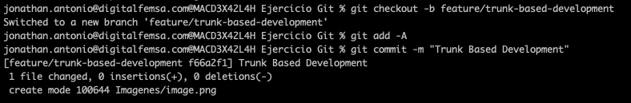
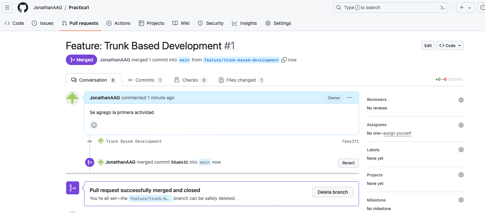
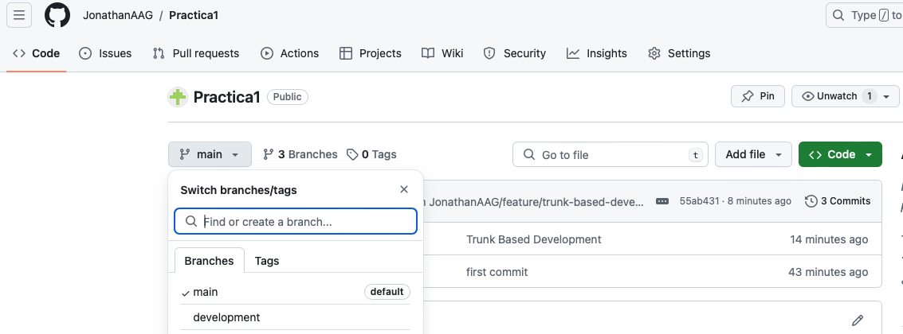

# Task 1

## Trunk Based Development:

Initialize a new repository and simulate a continuous integration environment by committing small changes directly to the main branch. Demonstrate quick feature integration and frequent commits.

### Resultados
**Se inicializo un nuevo repositorio**

](image.png)

Se realizaron los siguientes comandos: 
``` 
git checkout -b feature/trunk-based-development
git add -A
git commit -m "Trunk Based Development"
git push origin feature/trunk-based-development
```


Se genera pull request y se realiza el merge



## GitFlow

Set up a develop branch alongside the main branch. Create feature branches for new developments, merge them back into develop, and then finish with a release branch that merges into main.

### Resultados

Se tienen dos ramas main y development, y para algun cambio se genera una nueva rama feature



Se realizaron los siguientes comandos: 
``` 

git checkout -b feature/gitflow
git add -A
git commit -m "gitflow"
git push origin feature/gitflow