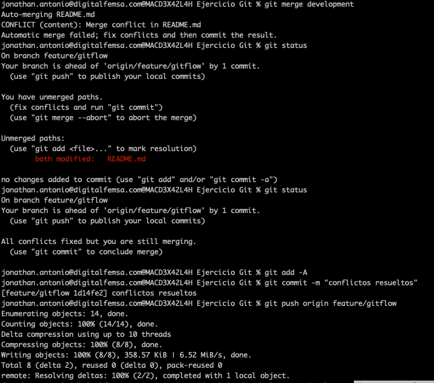

# Task 1

## Trunk Based Development:

Initialize a new repository and simulate a continuous integration environment by committing small changes directly to the main branch. Demonstrate quick feature integration and frequent commits.

### Resultados
**Se inicializo un nuevo repositorio**

](Imagenes/image.png)

Se realizaron los siguientes comandos: 
``` 
git checkout -b feature/trunk-based-development
git add -A
git commit -m "Trunk Based Development"
git push origin feature/trunk-based-development
```


Se genera pull request y se realiza el merge


## GitFlow

Set up a develop branch alongside the main branch. Create feature branches for new developments, merge them back into develop, and then finish with a release branch that merges into main.

### Resultados

Se tienen dos ramas main y development, y para algun cambio se genera una nueva rama feature


Se realizaron los siguientes comandos: 
``` 

git checkout -b feature/gitflow
git add -A
git commit -m "gitflow"
git push origin feature/gitflow

``` 


Se genera un PR de con los cambios de la rama feature hacia development


Se genera un PR de los cambios de development a la rama main


# Task 2
Participants will simulate development scenarios that lead to conflicts, requiring them to choose between merging and rebasing to resolve these issues.


### Resultados

Se genero un conflicto entre dos ramas


Se valida que la rama developmet este actualizada y se realizan los siguientes comandos:

``` 
git checkout feature/gitflow
git merge development
git status
```

Se resuelven los conflictos en los archivos 


Se agrega el cambio con los conflictos resueltos
``` 
git status
git add -A
git commit -m "conflictos resueltos"
git push origin feature/gitflow
```
Ejemplo ejecucion de comandos: 




# Task 3
In this exercise, participants will create pull requests to integrate changes from their feature branches into the main branch. They will then conduct code reviews, applying the best practices covered in the lessons.


### Resultados
Se genero un PR y se asigno a otro colaborador


Se realizo feedback
